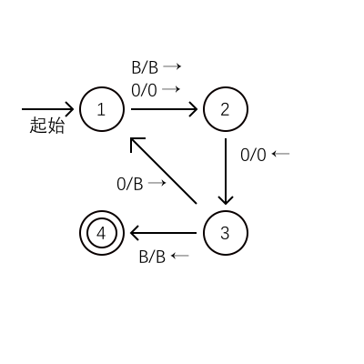

这一篇是这个系列的最后一篇。
我们的课程对这一部分并不够重视，所以这部分就放在考试周之后写了。

以下就进入正题了。

## 图灵机

图灵机可以理解为一个一个有限自动机加上一个双向无限长纸带。纸带上一开始是空的（也就是说，填满了空白符号），图灵机先把接收的字符串从左往右写在纸带上，然后才开始工作。纸带上可能的符号只有有限种。图灵机有一个指向纸带上某一格的指针，一开始是指向字符串最左边的字符所在的格的。然后图灵机自动地开始工作，每一步根据内部的状态和指针指向的字符更改内部状态，重写指向的字符，并将指针左移一格或右移一格，或者直接停机。如果图灵机最后停机并进入了某个特定的终结状态，那么就说明图灵机接受该字符串。

图灵机可以用下面的图表示：

{:.content-image}

能被图灵机接受的字符串组成的语言称为递归可枚举语言。如果这个图灵机对于任何串都停机，则这个语言称为递归语言。这两个名字与递归函数有关。

应该注意到，图灵机的纸带在任何时候都只有有限个非空白字符。

我们其实可以允许图灵机改变状态时不移动指针，只需要想要不移动指针时，右移进入一个对应的特殊状态，再左移进入目标状态即可。做这样的模拟至多将图灵机的计算步数增加一倍。

我们可以把图灵机的状态集和带符号集都变成有多个集合的笛卡尔乘积，这样我们的图灵机便可以在内部状态内存储有限多的数据，而纸带也可以看作是多个纸带并联得到的多道的宽纸带。

我们还可以给图灵机增加更多的纸带。然而，k 个纸带的图灵机可以用一个 2k 道宽的纸带的图灵机模拟。事实上，我们在一半的道上记录 k 个纸带的内容，在剩下的带上记录指向各带的指针位置与用到的带的边界。这样，我们只需从左往右遍历一遍用到的所有格子，记录下所有的格子的符号，然后从右往左遍历一遍用到的所有格子，修改指针的位置与带符号，必要的时候扩展用到的带的边界，我们就成功地模拟了多带图灵机的一步。于是增加图灵机的带并不会增加图灵机的计算能力。然而使用这样的方法普通图灵机需要 O(n^2) 步才能完成多带图灵机的 n 步。事实上由于多带图灵机在 n 步之后用到的带的格子不超过 O(n) 个，我们可以轻松地得到这一结论。

我们还可以把图灵机改成非确定性的，也即在同一。这也不会增加图灵机的运算能力。事实上，我们可以使用确定性的双带图灵机模拟非确定性的图灵机。注意到我们可以用字符串来表示图灵机的全部状态，我们只需一开始把初始状态写在第一个带上，然后把第一个带视为可抵达的状态的序列，然后从左往右逐个处理可能的状态，并在状态为接受的状态时进入接受状态并停机，其他时候将此状态剪切到第二条带上，并将它的可能的下一个状态补在第一条带的右侧。这种做法相当于在所有的状态中做广度优先搜索，所以可以很容易地得知此结论是正确的。然而由于它是广度优先搜索，那么在可能的下一步的数量最大值为 m 时，使用这样的方法确定性图灵机需要 O(n\*m^n) 步才能对非确定性图灵机进行模拟。

## 一些其他的机器

我们把图灵机的纸带剪断，只使用一半的纸带，这样就得到了半无穷带的图灵机。事实上用双道的半无穷带的图灵机就可以模拟图灵机，只需要在接近边界时更换方向和使用的道即可。于是它的计算能力是与普通图灵机等同的。

如果给下推自动机加上更多的栈，就得到了多栈的下推自动机。两个栈的下推自动机就可以模拟图灵机，只需要用栈之间的倒腾模拟带的移动即可。另一方面，多栈的下推自动机可以用多带图灵机模拟。于是多于两个栈的下推自动机的计算能力也是与图灵机等同的。

我们给多栈的下推自动机增加一个限制：每个栈除了栈底的符号以外，其余的符号都是相同的。这时我们可以把每个栈都视为一个计数器，只能判断其上的数是否为 0 并进行加一或减一操作。这样的机器称为计数器机。计数器机显然可以用多栈的下推自动机模拟。出乎意料的是，单个计数器的计数器机的表达能力是和确定型下推自动机等同的，而这个结论的证明是困难的。

另一方面，两个计数器就可以模拟任意多的计数器。事实上，我们取前 k 个质数 p_1,p_2,...,p_k ，然后我们在第一个计数器中存 (p_1)^{x_1}\*(p_2)^{x_2}\*...\*(p_n)^{x_n} 用第二个进行运算操作。要检测第 i 个计数器是否为空时，利用第二个计数器看第一个计数器除以 p_i 是否能整除，要修改第 i 个计数器时，利用第二个计数器将第一个计数器乘或除以 p_i 即可。另一方面，使用三个计数器可以模拟两个栈。假设栈符号只有 t 种，我们可以用 t 进制数来模拟栈，要压入某个符号时利用第三个栈进行乘 t 并加上余数的操作，要弹出某个符号时利用第三个栈进行除以 t 并取出余数的操作即可。于是于是多于两个计数器的下推自动机的计算能力也是与图灵机等同的。

使用普通计算机是可以模拟图灵机的。尽管由于存储大小的限制，计算机实际上是状态数巨大的有限状态机，但是我们可以通过提醒人工更换硬盘来规避这一点。然而，普通计算机也可以用图灵机模拟，并且图灵机需要的步数和普通计算机相比只有多项式级别的区别。这件事比较显然，但较为复杂。我们用多个不同的带模拟计算机的不同部分，就可以用多带图灵机模拟普通计算机。于是普通计算机和图灵机的计算能力也是等同的。

## 问题与可判定性

我们可以用图灵机来解决一般的“是/否”问题。我们只需把问题的输入编码，并将使问题答案为真的输入的编码作为一种语言即可。那么，要知道一个问题是否是可判定的，只需要考察对应的语言是否能被总是停机的图灵机接受，是不是递归语言即可。
如果一个问题，其对应的语言与这个语言的补均为递归可枚举语言，那么这个问题就是可判定的。事实上，我们只需同时模拟这个语言与这个语言的补的图灵机即可判定此问题。

问题之间可以归约。如果能把一个问题的编码串变成第二个问题的编码串，同时不改变问题的答案的图灵机存在，就可以把一个问题归约为第二个问题。这样只要第二个问题可判定，则第一个问题可判定。而若第一个问题不可判定，则第二个问题也不可判定。

我们可以将图灵机编码为字符串。我们也可以使用图灵机来模拟字符串对应的图灵机在给定的输入下的行为。但是，一个图灵机在给定的输入下是否停机是不可判定的，这称为停机问题。要证明这一点，我们先证明：一个图灵机是否在输入为它自己的编码时停机是不可判定的。事实上如果判定此问题的图灵机存在，就可以构造一个图灵机，他在接收输入为它自己的编码时停机的图灵机的编码时不停机，在接收输入为它自己的编码时不停机的图灵机的编码时停机，而这个图灵机接收自己的编码时，既不能停机，也不能不停机，于是这样的图灵机不存在，结论成立。于是，一个图灵机在给定的输入下是否停机也是不可判定的，不然我们就可以用判定这个问题的图灵机稍作修改去判定之前那个问题了。这也意味着，判断一个程序在给定的输入下是否死循环也是不可能的。

另一个关于图灵机的不可判定问题是，判断某个图灵机对应的语言是否属于某个非平凡的（非空集也非全集的）语言集合。事实上，如果这样的图灵机存在，那么就存在图灵机使得其可以判定一个图灵机在给定的输入下是否停机。不妨设该语言集合不包含空集，否则考虑它的补集。假设存在这样的图灵机，我们构造另一个图灵机，它有两条带，它先在第一条带上模拟给定的图灵机在给定操作下是否停机，等停机后便判断第二条带上的带上的串是否属于给定的语言集合中的某一个确定的语言（此语言存在且非空，因为语言集合非平凡且不含空集）。这样，若给定的图灵机在给定操作下停机，则新图灵机的语言为给定的语言集合中的某一个确定的语言，否则新图灵机的语言为空语言。这样，通过判定此图灵机是否属于给定的语言集合就可以得出对应的拟给定的图灵机在给定操作下是否停机。所以结论成立，某个图灵机对应的语言是否属于某个非平凡的语言集合是不可判定的。

接下来有一个与图灵机没什么关系但是是不可判定的问题：斯波特对应问题。斯波特对应问题是这样的：给定两组字符串 w_1,w_2,...,w_k 和 x_1,x_2,...,x_k ，问是否存在一个下标列 i_1,i_2,...,i_m 使得 w_{i_1}w_{i_2}...w_{i_m}=x_{i_1}x_{i_2}...x_{i_m}（这称为斯波特对应）。要证明这个问题是不可判定的，我们可以把停机问题归约到修改的斯波特对应问题，再归约到斯波特对应问题。修改的斯波特对应问题和修改前相比唯一的区别就是指定了下标列中第一项的值为 1。

我们先把修改的斯波特对应问题归约到斯波特对应问题。我们增加两个字符 \* 和 $，把第一组第一个字符串和第二组所有字符串每个字符前面都加上 \* ，在第二组其他字符串每两个字符中间加上 \* ，最后在第一组和第二组后面分别加上字符串 $ 和 \*$。这样，新的字符串组若存在斯波特对应，那么就必然第一个下标为一，于是，新的字符串组若有斯波特对应当且仅当旧字符串组有第一个下标为一的斯波特对应。归约完成。

接下来我们完成停机问题到修改的斯波特对应问题的归约。我们不妨假设停机问题中的图灵机是半无穷带的图灵机。我们用形如 αpβ 的串表示图灵机的状态，其中 α 是指针左边的串， β是指针指向的格子及其右边的串。我们设两组字符串中第一个字符串分别为 #[p0]w# 和 # ，其中w为输入字符串，[p0] 为图灵机初始状态，然后，两组中有对应的字符串 # 和 #，并且对于所有的带符号 x，都有对应的字符串 x 和 x，其后，如果图灵机在带符号为 X 状态为 p 时下一步左移并改写带符号为 Y 并且左移一格，则对任意带符号 Z 两组中有对应的字符串 ZpX 和 pZY，若 X 为空白符号对任意带符号 Z 还有对应的字符串 Zp# 和 pZY#，若为右移则有对应的字符串 pX 和 Yp，若 X 为空白符号还有对应的字符串 p# 和 Yp#，最后对于终结状态 [pf] ，对于任何带字符 X,Y 都有对应的字符串 X[pf]Y 和 [pf]，X[pf] 和 [pf]，[pf]Y 和 [pf]，以及有对应的字符串 [pf]## 和 #。这样，构造斯波特对应对应的过程就恰好为生成图灵机的状态串的过程，归约完成。

利用斯波特对应问题我们可以证明一些关于上下文无关语言的问题的不可判定性。我们规定一组字符串 x_1,x_2,...,x_k 对应的文法为 A-> x_1A1\|x_2A2\|...\|x_kAk\|x_11\|x_22\|...\|x_kk，那么，可以通过构造确定型下推自动机证明这个文法对应的语言的补也是上下文无关语言。考虑斯波特对应问题中两组字符串的文法的语言的并，我们就可以知道上下文无关文法是否有歧义是不可判定的。考虑斯波特对应问题中两组字符串的文法的语言的交，我们就可以知道上下文无关语言的交集是否为空集是不可判定的。考虑斯波特对应问题中两组字符串的文法的语言分别的补的并以及字符串全集，我们就可以知道，两个上下文无关语言是否相等、一个上下文无关语言是否等于某个正则语言，一个上下文无关语言是否是字符串全集、一个上下文无关语言是否是另一个上下文无关语言的子集、一个上下文无关语言是否是另一个正则语言的子集，都是不可判定的。

## P 与 NP

可以用在与输入长度相比多项式时间内停机的图灵机解决的问题为 P 问题，如果放宽为非确定性的图灵机，则为 NP 问题。之前构造的确定性图灵机对非确定性图灵机的模拟是指数时间的，所以 NP 问题和 P 问题之间似乎存在很大的差距，然而 P=NP 是否为真仍然是未知的。

如果两个问题之间的归约能在多项式时间内完成，那么就说两个问题之间有多项式时间的归约。能被所有 NP 问题在多项式时间内归约到的问题称为 NP-难问题，如果它本身也是NP问题则称为 NP 完全问题。一旦一个 NP 完全问题被证明是 P 问题，那么就有 P=NP 了。

第一个 NP 完全问题是 SAT 问题：包含多个变元、与、或、非、括号的布尔表达式是否可以为真。首先它是 NP 问题，因为我们可以利用非确定性图灵机的非确定性质在 O(n) 时间（n 为变元数量）内遍历所有分支，并在多项式时间内测试表达式是否为真。下面证明任何 NP 问题均可归约到 SAT 问题。对于任意一个 NP 问题，都有一个非确定性的图灵机，使得其能解决这个问题，不妨设这是一个半无穷带上的非确定性的图灵机，并且在输入长度为 n 时运行步数不多于 p(n) ，其中 p 为一个多项式函数。我们用长度为 p(n)+1 的串来表示图灵机的状态，其中包括 p(n) 个带符号和一个插在中间的状态。考虑一个长宽均为 p(n)+1 的表格，在每一行填写每一步的图灵机的状态（如果步数少于 p(n) 步则最后的一步之后所有行都相等），那么问题答案为真当且仅当填法合法并且最后一行含有终结状态。对于每一个格子和每一个状态或带符号，我们建立一个变元，表示该格是否填写了该符号。我们构造一个布尔表达式表示是否填法合法并且最后一行含有终结状态。这个布尔表达式由四部分的与组成。第一部分为：每一个格子都恰好填了一个符号，这一部分有 O((p(n))^2) 个符号；第二部分为：第一行确实为初始状态，这一部分有 O(p(n)) 个符号；第三部分为：最后一行确实含有终结状态，这一部分有 O(p(n)) 个符号；第四部分为，确实表格表示了图灵机状态转移，这部分有 O((p(n))^2) 个符号。这样，我们便构造出了相应的布尔表达式，归约完成。于是 SAT 问题是 NP 完全问题。

如果一个 NP 问题能由一个 NP 完全问题在多项式时间内归约到，那么它也是一个 NP 完全问题，因为任何 NP 问题都在多项式时间内能归约到该 NP 完全问题，再归约到此问题。

我们考虑 CSAT 问题：和 SAT 问题相同，但要求输入为合取范式。合取范式定义为若干个子句的与，子句定义为若干个文字的或，而文字定义为一个变元或其非。CSAT 问题显然也是 NP 问题，因为 SAT 问题是 NP 问题。我们下面通过把 SAT 问题在多项式时间内归约到 CSAT 问题证明其为 NP 完全问题。我们证明，对于任何布尔表达式 E，我们都可以在相对 E 的长度的多项式时间内构造出合取范式 F，使得 E 可能为假当且仅当 F 可能为假。首先我们可以在多项式时间内把非全部挪到变元的前面。我们对 E 的长度进行归纳构造。若 E 中只有一个或两个变元符号，那么取 F=E 即可；若 E=E1 and E2，F1 和 F2 分别为 E1 和 E2 的对应构造，那么取 F=F1 and F2 即可；若 E=E1 or E2，F1 和 F2 分别为 E1 和 E2 的对应构造，那么设 F1=h1 and h2 and ... and hp,F2=g1 and g2 and ... and gq，则新建一个变元 y，并且令 F=(h1 or y)and(h2 or y)and...and(hp or y)and(g1 or not y)and(g2 or not y)and...and(gq or not y) 即可。可以归纳地证明，构造时间不超过 O(\|E\|^2)，归约完成。

接下来我们考虑 3-SAT 问题：和 SAT 问题相同，但要求每个子式中恰好有三个文字。3-SAT 问题显然也是 NP 问题，因为 SAT 问题是 NP 问题。我们下面通过把 CSAT 问题在多项式时间内归约到 3-SAT 问题证明其为 NP 完全问题。我们依次处理合取范式中的各个子式 x_1 or x_2 or ... or x_m。若 m=1，新建两个变元 x,y，转换为 (x_1 or x or y)and(x_1 or not x or y)and(x_1 or x or not y)and(x_1 or not x or not y)；若 m=2，新建一个变元 x，转换为(x_1 or x or x_2)and(x_1 or not x or x_2)；若 m=3，原样照抄；若 m>=4，新建 m-3 个变元 y_1,y_2,...,y_{m-3}，转换为 (x_1 or x_2 or y_1)and(x_3 or not y_1 or y_2)and...and(x_{m-2} or not y_{m-4} or y_{m-3})and(x_{m-1} or x_m or not y_{m-3}) 即可。只需线性时间即可完成这个构造，归约完成。可以看到，3-SAT 中的 3 换作任何一个不小于 3 的整数后仍然是 NP 问题。然而， 2-SAT 与 1-SAT 都是 P 问题。
利用 3-SAT 问题可以证明一些关于图论的问题是 NP 问题。首先是独立集问题：给定一个无向图和正整数 k，问图中是否存在 k 个互不相邻的顶点（它们组成的集合称为独立集）。它显然是 NP 问题，因为我们可以猜测所有的 k 元点集。我们下面通过把 3-SAT 问题在多项式时间内归约到独立集问题证明其为 NP 完全问题。我们假设 3-SAT 有 m 个子式，对于所有 3m 个文字，我们均建立一个顶点，然后两个顶点有边相连当且仅当这两个顶点对应的文字在同一个子式中或互为非。那么这个图有 m 顶点独立集，当且仅当 3-SAT 可以为真。事实上，这个图有 m 顶点独立集当且仅当可以安排变元的值使得每个子式中可以选出一个为真的文字。于是归约完成。由独立集问题可以得出下面的顶点覆盖问题也是 NP 完全的：是否在给定的无向图中，可以找出 k 个顶点使得任何一条边都有一个顶点在这个边上（这 k 个顶点称为顶点覆盖）。事实上，独立集的补就是顶点覆盖，所以这两个问题是等价的。

另一个问题，哈密顿问题，也是 NP 问题。所谓哈密顿问题，就是一个图是否有遍历所有顶点的圈。我们先讨论有向图的哈密顿问题。显然这也是个 NP 问题，只需要猜测边的序列即可。我们下面通过把 3-SAT 问题在多项式时间内归约到哈密顿问题证明其为 NP 完全问题。这个构造比较麻烦，我们需要一张图，如下：

{:.content-image}

我们对于每个变元，构造一个左边的图，将它们顺序环状连接起来。对于每一个子句，构造一个右边的图。对于每一个子句中的每一个文字，我们将子句的图和对应的文字的变元的图连接起来。若文字为变元本身，将对应的两个顶点连到变元的图中从左上到右下的边的两个顶点上；若文字为变元的非，将对应的两个顶点连到变元的图中从右上到左下的边的两个顶点上。例子如下：

{:.content-image}

这样，哈密顿圈存在当且仅当可以安排变元的值使得每个子式中可以选出一个为真的文字。事实上，此图中的哈密顿圈只能是从左侧循环中跳出到子式的图当中再跳回来的。那么，子式的图中选择的路径对应着为真的文字，而变元的图保证了互为非的文字不同时为真。这个构造显然可以在多项式时间内完成，归约成立。

接下来我们讨论无向图的哈密顿圈问题，它显然也是 NP 问题。我们可以简单的从有向图的哈密顿圈问题归约到无向图的哈密顿圈问题。我们只需把每个顶点变成 3 个顶点，三个节点依次相连，连入的边连在第一个顶点上,连出的边连在第三个节点上即可。这样，由于哈密顿圈要经过所有的第二个顶点，这个哈密顿圈必然总是依次经过一组三个顶点，故必然有对应的有向图的哈密顿圈。这个构造显然可以在多项式时间内完成，归约成立，于是无向图的哈密顿圈问题也是 NP 问题。由此还可推出，带权无向图最短哈密顿圈问题也是 NP 问题。

## 其他问题类

P 问题的补必然是 P 问题。然而 NP 问题的补是否是 NP 问题是未知的。我们倾向于认为 NP 完全问题的补不是 NP 问题。

可以用只使用与输入长度相比多项式空间的图灵机解决的问题为 PS 问题，如果放宽为非确定性的图灵机，则为 NPS 问题。显然 NP 问题都是 NPS 问题，P 问题都是 PS 问题，PS 问题都是 NPS 问题。令人意外的是 NPS 问题都是 PS 问题。首先，NPS 问题对应的非确定性的图灵机在给定的输入下可能出现的状态总数的对数相对输入长度不超过多项式级别。其次，我们构造一个图灵机，其遍历所有可能的终结状态，测试能否在若干步内抵达终结状态。若可以直接判定则结束，否则遍历一半步数时可能的状态，并递归的测试能否抵达此状态和从此状态能否抵达终结状态。由于递归的深度不多于可能出现的状态总数的对数，所以占用空间相对输入而言是多项式级别的，结论成立。

和 NP 完全问题相应的，也有 PS 完全问题。能被所有 PS 问题在多项式时间内归约到的 PS 问题称为 PS 完全问题。第一个 PS 完全问题是带有量词的布尔表达式求值问题（QBF 问题）：带有存在与全称量词的布尔表达式是真还是假。我们可以直接递归的求解带有量词的布尔表达式，而递归的深度不超过表达式长度，所以带有量词的布尔表达式求值是 PS 问题。接下来，我们证明任何任何 PS 问题均可归约到 QBF 问题。任何 PS 问题都有对应的确定性的图灵机，不妨设是半无穷带图灵机，使得它在与输入长度为 n 时只在 p(n) 长度的带上工作，其中 p 为多项式函数，那么图灵机只可能在 O(exp(p(n))) 步内接受。我们用多个变元表示一个图灵机状态，每个变元表示状态字符串的某一位是什么符号。为了简单，我们采取基于状态的符号，用状态之间的关系代替变元之间的关系，这样的代替是多项式时间的，但是代替过程中除了添加具体的变元还要添加使状态合法的变元约束。我们构造形如 (exist I0)(exist I1)(S and N and F) 的带有量词的布尔表达式，其中 S 表示初始状态是 I0，可以在多项式时间构造出来；F 表示初始状态是 I1，可以在多项式时间构造出来；N 表示可以在 k 步内从 I0 转移到 I1，其中 k 为 2 的幂且略大于 O(exp(p(n)))，为了构造这一表达式，我们记 N(u,v,m) 为可以在 ｍ 步内从 u 转移到 v 的带有量词的布尔表达式，那么，m=1 时可以在多项式时间内直接构造，而若有 m=t 的构造，m=2t 时构造 N(u,v,m)=(exist f)(all p)(all q)(N(p,q,t) or not((p=u and q=f)or(p=f and q=v))) 即可，这样，N=N(I0,I1,k) 可以在多项式时间内递归的构造出来。于是，规约完成，QBF 问题是 PS 完全问题。

我们考虑带随机化图灵机：这个图灵机有一个带上填满了随机的位。如果一个语言，可以让一个随机化图灵机要么以 0 概率接受语言之外的串，要么以至少 1/2 概率接受语言中的串，并且一定在多项式时间内停机，那么这个语言称为 RP 类语言。如果随机化图灵机总是给出相同的结果，并且停机时间的期望为多项式时间，那么对应的语言称为 ZPP 类的语言。显然 P 问题都是 ZPP 问题。若一个问题和他的补都是 RP 问题，那么只需要同时运行这个问题和其补的随机化图灵机，直到其中有一个接受即可，运行时间的期望不多于多项式时间乘以 2(1+1/2+1/4+...) 也是多项式时间，于是问题也是 ZPP 问题。若一个问题是 ZPP 问题，那么其运行 2 倍期望时间后不停止的概率不大于 1/2（否则期望不正确），于是在此截断可得，这个问题也是 RP 问题。显然 ZPP 问题的补也是 ZPP 问题，于是 ZPP 问题集是 RP 问题集与 RP 补问题集的交。又非确定性图灵机可以多项式模拟所有可能被多项式时间内停机的随机化图灵机读到的随机串的序列，故 RP 问题都是 NP 问题。

最后我们讨论一下质数检测问题：二进制串是否表示质数。随机取小于输入的数的数，利用快速幂算法和费马小定理进行判断，如果输入为合数则至少能有 1/2 的概率判断出来，所以判断合数为 RP 问题，从而是 NP 问题。又一个数 p 是质数，当且仅当存在一个小于该数的整数 x 使得满足 x^k=1(mod p) 的最小正整数 k 为 p-1，而若 x^(p-1)=1(mod p) 必然有满足 x^k=1(mod p) 的最小正整数 k 整除 p-1。于是我们用非确定性图灵机猜测 p-1 的因子，然后递归地检查它们都是质数，然后验证 x^(p-1)=1(mod p)，以及对于任意一个质因子 q 有 x^(p-1)/q!=1(mod p) 即可。这样的过程可以证明是多项式时间的，因为质因子列表长度是相对输入整数位数是多项式的，于是判断质数也是 NP 问题。质数检测问题不像是 NP 完全的，不然就有 NP 问题的补也是 NP 问题了。

## 结束

这篇笔记是这个系列的最后一部分。

能够看下来真是辛苦了。

就是这样了。