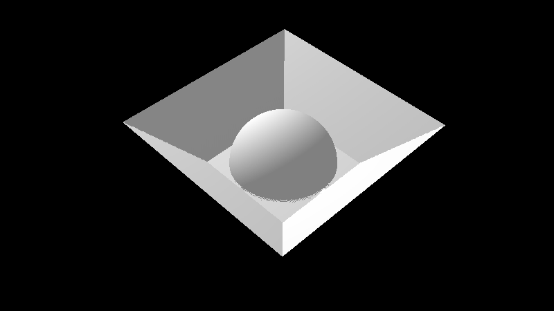
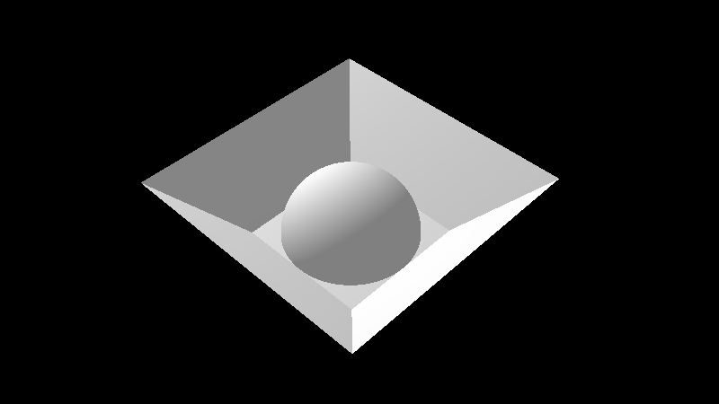
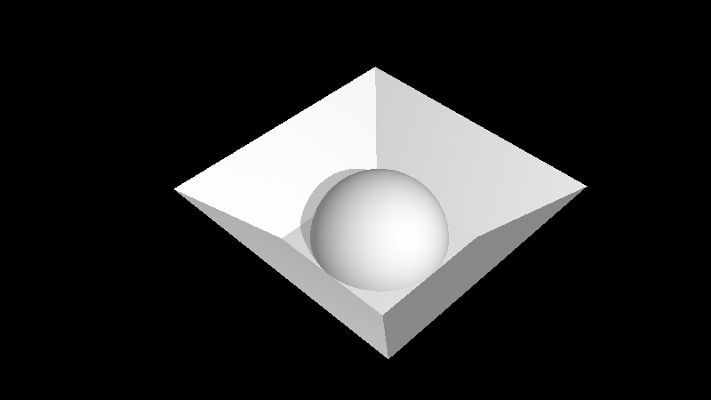
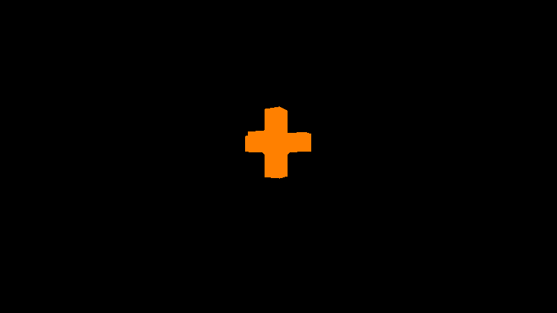
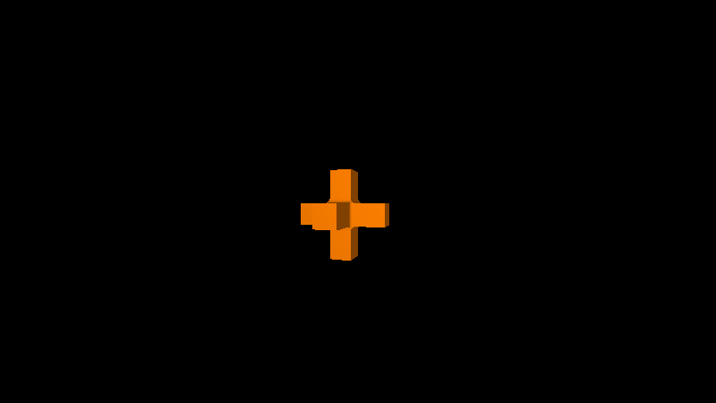

Shadertoy 是一个可以让你编写和分享片元着色器的网站。知道一点 GPU 渲染管线的应该明白，基本的三维图形实时渲染是先把顶点信息塞给 GPU，并通过顶点着色器处理顶点的信息，然后再由 GPU 硬件把每个几何单元（一般是三角形）变成一个个的像素，并进行插值，最后在片元着色器计算最终的颜色。Shadertoy 缺少顶点着色器，这意味着它只能为屏幕空间中的每个像素计算一个颜色。然而即便是有这样的限制，我们依旧能用其他的方法进行三维图形的渲染。Shadertoy 的创始人之一 Inigo Quilez 就是这一位这方面的专家，他在 [自己的网站](https://www.iquilezles.org/www/index.htm){: target="_blank" rel="noopener"} 上写了很多文章介绍这些技术和技巧。接下来我们来学习一下这些技术当中最基本的一些东西，了解一下 Shadertoy 上这些神奇的着色器是如何运作的。

## Ray marching

既然我们只有片元着色器，那么我们直接在片元着色器里跑一整套光线追踪算法就好了嘛。确实如此，但是由于 GPU 的性能限制，我们不能直接对大量的面元进行取交操作，所以需要一些技巧才能处理复杂的形状。在 Shadertoy 中我们一般通过 Ray marching 的方法进行求交。所谓 Ray marching 就是让射线一步一步向前试探，到了射线前进到了物体内部之后就能判断已经相交了。Ray marching 在一般的实时图形编程中也用得到，比如体积云雾效果的实现，以及 [浮雕贴图](https://en.wikipedia.org/wiki/Relief_mapping_(computer_graphics)){: target="_blank" rel="noopener"} 等等。既然说到了浮雕贴图，那么可以想到我们可以在 Shadertoy 里直接利用浮雕贴图的方法做三维图形渲染。接下来我们就来写一个试试。

首先，让我们准备好深度贴图和法线贴图，为了简单我们直接用两个函数来实现：

```glsl
float texDepth(vec2 pos){
	float baseDepth=.5-max(abs(pos.x-0.5),abs(pos.y-0.5));
    float dsquare=(pos.x-0.5)*(pos.x-0.5)+(pos.y-0.5)*(pos.y-0.5);
    float ball=dsquare>1./16.?.25:(.25-sqrt(1./16.-dsquare));
    return min(ball,clamp(baseDepth,0.,.25));
}

vec3 texNormal(vec2 pos){
    if(abs(pos.x-0.5)>=0.25||abs(pos.y-0.5)>=0.25){
        if(abs(pos.x-0.5)<=0.5&&abs(pos.y-0.5)<=0.5){
            vec3 leftdown=(pos.x>pos.y)?vec3(0,1,1):vec3(1,0,1);
            vec3 rightup=(pos.x>pos.y)?vec3(-1,0,1):vec3(0,-1,1);
            return normalize((pos.x+pos.y>=1.)?rightup:leftdown);
        }
    }
    float dsquare=(pos.x-0.5)*(pos.x-0.5)+(pos.y-0.5)*(pos.y-0.5);
    if(dsquare<=1./16.){
        return normalize(vec3(pos.x-0.5,pos.y-0.5,sqrt(1./16.-dsquare)));
    }
	return vec3(0,0,1);
}
```

可以看出来，贴图的内容是在坑里放一个半球。

接下来，我们计算一下每个像素对应的射线方向：

```glsl
//基于四元数的旋转
vec4 quaternion(vec3 axis,float angle){
	float halfang=angle/2.;
    return vec4(axis*sin(halfang),cos(halfang));
}

vec4 quaternionMultiply(vec4 q1,vec4 q2){
	return vec4(q1.xyz*q2.w+q1.w*q2.xyz+cross(q1.xyz,q2.xyz)
        ,q1.w*q2.w-dot(q1.xyz,q2.xyz));
}

vec3 rotation(vec4 q,vec3 pos){
	return pos+2.*cross(q.xyz,cross(q.xyz,pos)+q.w*pos);
}

// 给出当前像素的光线方向
vec3 rayDirection(vec2 fragCoord){
    float zoom=1.2;
    vec2 offset=fragCoord/iResolution.xy-0.5;
    offset.y/=iResolution.x/iResolution.y;
    vec3 rawDir=vec3(offset/zoom,-1.);
    // 在这里我们用 ShaderToy 提供的 iMouse 来获取鼠标位置，这样就可以用鼠标改变视角
    vec2 mouseAngles=iMouse.xy/iResolution.xy-0.5;
    vec4 qUpDown=quaternion(vec3(1,0,0),radians(45.+mouseAngles.y*30.0));
    vec4 qLeftRight=quaternion(vec3(0,0,1),radians(-45.-mouseAngles.x*30.0));
    vec4 q=quaternionMultiply(qLeftRight,qUpDown);
    return normalize(rotation(q,rawDir));
}
```

接下来是核心的 Ray marching 部分

```glsl
#define iteration 128
// start 为光线的起点，dir 为光线的方向，maxDepth 为光线前进的深度上限，返回值为最终的交点
vec3 rayMarching(vec3 start,vec3 dir,float maxDepth){
    // 分成若干步，注意我们这里除以了方向的 z 分量，这样使得每一步前进的深度是一定的
    vec3 steps=-dir/dir.z*maxDepth/float(iteration);
    vec3 pos=start;
    for(int i=0;i<iteration+1;i++){
        vec3 next=pos+steps;
        // 判断是否已经前进到了地面里面
        if(next.z+texDepth(next.xy)<0.){
            return pos;
        }
        pos=next;
    }
    return pos;
}
```

最后我们把一切拼在一起，加上光照效果

```glsl
float lighting(vec3 pos){
    // 用 ShaderToy 提供的 iTime 让光源旋转起来！
    vec3 light=vec3(2.1*sin(iTime)+0.5,2.1*cos(iTime)+0.5,1.75);
    // 为了偷懒（？）以及美术效果我们仅计算漫反射部分
    float diffuse=clamp(dot(normalize(light-pos),texNormal(pos.xy)),0.,1.);
	return diffuse*.5+.5;
}

// ShaderToy 的主函数和一般的 glsl 不同， ShaderToy 会为我们编译成在 WebGL 中使用的片元着色器
void mainImage( out vec4 fragColor, in vec2 fragCoord )
{
    // 让相机也左右移起来
    vec3 cameraPos=vec3(-1.+.25*sin(iTime),-1.-.25*sin(iTime),2.0);
    vec3 dir=rayDirection(fragCoord);
    // 我们先让光线前进到高度 0 处再进行 Ray marching，毕竟场景里没有高度大于 0 的东西
    float t=-cameraPos.z/dir.z;
    vec3 pos=rayMarching(cameraPos+t*dir,dir,.25);
    fragColor = vec3(1,1,1).zzzz*lighting(pos);
}
```

然后让我们看看效果：

{:.content-image}
注意球面边缘的 Artifact

看来我们的 Ray marching 求交过程还不够精确，所以在贴图高度变化比较大的地方产生了错误的条纹状图案。不过既然射线不太可能在一步之中和表面相交两次，我们可以在找到相交的那一步之后再做一个二分查找提高精度。

```glsl
#define iteration 128
#define binaryPass 16
vec3 rayMarching(vec3 start,vec3 dir,float maxDepth){
    vec3 steps=-dir/dir.z*maxDepth/float(iteration);
    vec3 pos=start;
    // 多来一步免得扑空
    for(int i=0;i<iteration+1;i++){
        vec3 next=pos+steps;
        if(next.z+texDepth(next.xy)<0.){
            // 新增的部分，继续二分提高精度
            for(int j=0;j<binaryPass;j++){
                vec3 mid=(pos+next)/2.;
                if(mid.z+texDepth(mid.xy)<0.){
                    next=mid;
                }else{
                	pos=mid;
                }
            }
            return pos;
        }
        pos=next;
    }
    return pos;
}
```

效果如图

{:.content-image}
这个效果不错

最后我们还可以加上阴影效果，这样可以对光源有更好的表现。我们只需要再做一次光源到表面的 Ray marching 判断有没有交点就好了：

```glsl
float lighting(vec3 pos){
    vec3 light=vec3(2.1*sin(iTime)+0.5,2.1*cos(iTime)+0.5,1.75);
    float diffuse=clamp(dot(normalize(light-pos),texNormal(pos.xy)),0.,1.);
    // 从光源与当前位置连线和高度 0 处平面的交点开始进行 Ray marching
    vec3 lightdir=normalize(pos-light);
    vec3 start=light-(light.z/lightdir.z)*lightdir;
    vec3 steps=(pos-start)/float(iteration);
    for(int i=0;i<iteration;i++){
        vec3 current=steps*float(i)+start;
        if(current.z+texDepth(current.xy)<0.){
            //我们只需要判断是否有交点就好，不必确定交点位置
            // 当然，这个阴影处的颜色计算也是很随意的，因为懒（？）
        	return diffuse*.25+.5;
        }
    }
	return diffuse*.5+.5;
}
```

{:.content-image}
加上阴影之后的效果

最后再加上颜色就可以完成了。最终的效果可以在 [这里](https://www.shadertoy.com/view/wdjcWV){: target="_blank" rel="noopener"} 看到。

## 有符号距离函数（Signed distance function，SDF）

可以看到，上一节中的 Ray marching 方法还是有一定局限性的。它每一步的步长是固定的，所以某种程度上不够灵活。接下来我们来介绍更灵活的 [基于有符号距离函数的方法](https://www.iquilezles.org/www/articles/raymarchingdf/raymarchingdf.htm){: target="_blank" rel="noopener"}。

所谓有符号距离函数，就是一个用来表示与空间中一点与某个物体的边界的距离的一个函数。如果我们用有符号距离函数来表示物体，我们就可以使用它来确定光线前进的步长，这样我们就能较快得收敛到光线与物体的交点，同时由于有符号距离函数的性质我们不必担心步子太大越过了要求的交点。同时，由于有符号距离函数在物体边界上某一点的梯度就是物体在这一点的法向量，所以我们可以 [通过数值方法](https://www.iquilezles.org/www/articles/normalsSDF/normalsSDF.htm){: target="_blank" rel="noopener"} 从有符号距离函数计算出物体表面的法向量，以此完成光照的计算。当然，有时我们不需要绝对的有符号距离函数，只需要在一定范围（比如物体外部）内精确的近似有符号距离函数就好，毕竟在某些地方有错误的值并不会对最终结果产生太大的影响。

接下来我们来写一个使用基于有符号距离函数的 Ray marching 渲染的着色器。与之前的相同和类似的部分我们就不重复了

首先让我们准备好有符号距离函数：

```glsl
//这里我们使用的是一个三个长方体互相交叉形成的十字形
//具体的数学推导过程我们就略去了，留作习题
float sdfCross(vec2 dimension,vec3 p){
    vec3 xmaxP=abs(p);
    xmaxP=xmaxP.x<xmaxP.y?xmaxP.yzx:xmaxP;
    xmaxP=xmaxP.x<xmaxP.y?xmaxP.yzx:xmaxP;
    xmaxP=xmaxP.x<xmaxP.z?xmaxP.zxy:xmaxP;
    vec3 diff=xmaxP-dimension.xyy;
    float maxdiff=max(max(diff.x,diff.y),diff.z);
    vec3 connection=maxdiff>0.?diff:vec3(0.,-maxdiff,dimension.y-xmaxP.x);
	return sign(maxdiff)*length(max(connection,0.));
}

float sdf(vec3 p){
    // 让物体转起来
    vec4 qRot=quaternion(vec3(0,0,1),radians(iTime*10.));
    // 这里我们在返回值上加上 0.1，这样可以使让物体略微缩小一点，同时在接缝处制造平滑的效果
    // 这可能会在某些地方破坏有符号距离函数的性质，但是实际上对我们的渲染没啥影响
	return sdfCross(vec2(0.9,0.3),rotation(qRot,p))+.1;
}
```

然后编写我们的 Ray marching 函数，完成求交的部分：

```glsl
#define iteration 128
vec3 rayMarching(vec3 start,vec3 dir){
    // 这里由于物体上的点的 y 坐标一定在 -1 和 1 之间
    // 所以我们先直接前进到 y 为 -1 处
    float tmin=(-1.0-start.y)/dir.y;
    vec3 pos=tmin*dir+start;
    float t=tmin;
    if(tmin<0.){
        return pos;
    }
    for(int i=0;i<iteration;i++){
        // 直接把符号距离函数的返回值当作前进的距离
        float step1=sdf(pos);
        // 我们对于较远处的物体精度要求较低，但是对于近处我们需要更高的精度
        // 所以我们判断迭代结束的阈值是当前已经前进了的距离的一个倍数
        if(abs(step1)<.000001*t){
        	return pos;
        }
        t+=step1;
        pos=t*dir+start;
    }
    return pos;
}
```

然后我们来看看现在的效果

{:.content-image}
由于还没有实现光照效果，所以物体是纯色的

接下来我们来实现法线方向的计算，进而实现光照效果

```glsl

// 这里用数值方法计算梯度
// 我们使用 iq 的文章中的做法，取正四边形的四个顶点的方向进行采样，然后作差
// 由于最后还要 normalize，所以梯度值差个几倍不影响的
#define delta 0.00025
vec3 normal(vec3 pos){
    vec2 e=vec2(1.,-1.);
    vec3 rawNormal=e.xxx*sdf(pos+delta*e.xxx);
    rawNormal+=e.xyy*sdf(pos+delta*e.xyy);
    rawNormal+=e.yyx*sdf(pos+delta*e.yyx);
    rawNormal+=e.xxx*sdf(pos+delta*e.xxx);
    return normalize(rawNormal);
}

float lighting(vec3 pos){
    vec3 light=vec3(0.+sin(2.*iTime),-4.0,0.-cos(2.*iTime));
    // 这里同样为了偷懒（？）以及美术效果我们仅计算漫反射部分
    float diffuse=clamp(dot(normalize(light-pos),normal(pos)),0.,1.);
	return diffuse*.5+.5;
}

```

再来看现在的效果

{:.content-image}
效果还不错，可惜没有遮挡光源产生的阴影效果

到此为止，基础的渲染部分就完成了。我最终发布在 ShaderToy 的版本则修改了物体的有符号距离函数，使得物体在空间中重复了起来。可以在 [这里](https://www.shadertoy.com/view/tsffWs) 看到最终的效果。本文的题图就是这一着色器最终的渲染结果

当然，有符号距离函数更常见的应用是 [进行文本渲染的加速](https://github.com/libgdx/libgdx/wiki/Distance-field-fonts){: target="_blank" rel="noopener"} ，这样我只需要提前计算好文本形状的有符号距离函数的值，放进贴图里，就可以渲染放大后也不会糊掉的文本了，还可以用这个方法实现文字描边等效果。

## 接下来还可以做什么

如果还想在 Shadertoy 上写一些更强大，效果更好的着色器，你可以参考这些方向：

- [使用包围盒进行渲染加速](https://www.iquilezles.org/www/articles/sdfbounding/sdfbounding.htm){: target="_blank" rel="noopener"}
- 绕过某些硬件缺陷，比如 [更好地处理材质贴图](https://www.iquilezles.org/www/articles/filteringrm/filteringrm.htm)
- 更强大的光影效果，比如 [室外光照](https://www.iquilezles.org/www/articles/outdoorslighting/outdoorslighting.htm)
- 使用程序生成的几何物体，比如 [用 fBM 生成地表](https://www.iquilezles.org/www/articles/fbm/fbm.htm){: target="_blank" rel="noopener"}，[甚至真正的三维分形物体](https://www.iquilezles.org/www/articles/mandelbulb/mandelbulb.htm)

而我，就不必在这里细挖深究了，我还有别的东西要玩呢。